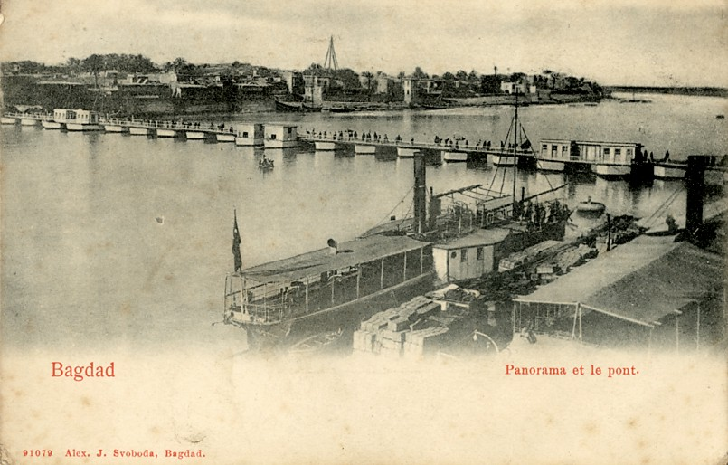
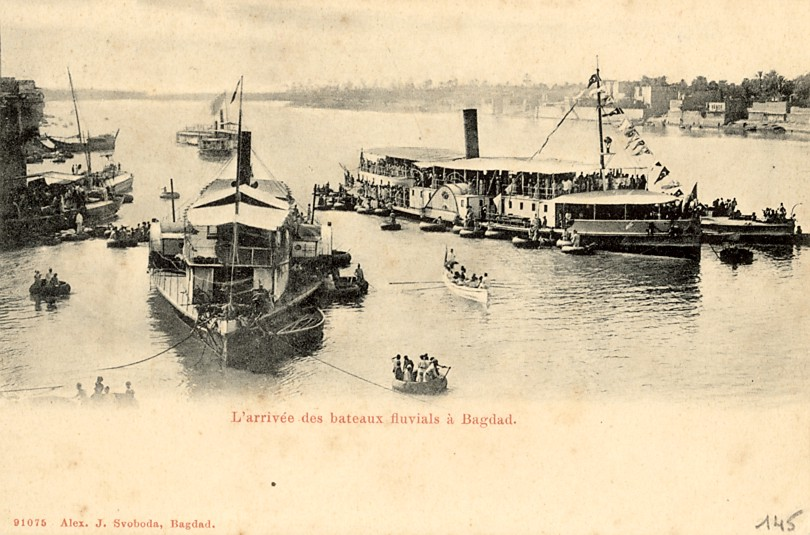

# River Map for Svoboda's Diaries Project

Check out the [project website](https://www.svobodadiariesproject.org/) and the [digital map](https://shi-lin-li.github.io/SDP-mapping/index.html#8/32.674/44.953)!

## Background

This digital geography project is developed based on the material of **Svoboda's Diaries**. The Svoboda's Diaries are a collection of diaries keeper by members of the Svoboda family, a family living in Baghdad during the 19th century. The work of this digital river map is part of Svoboda Diaries Project. The Svoboda Diaries Project began in 2006 as a project under the umbrella of the Ottoman Texts Archive Project, started in the University of Washington in 1993. The Project is an ongoing collaborative research and publication effort headed by the project Principal Investigators, Professor Walter G. Andrews, Emeritus Professor of Near Eastern Languages and Civilization and Annie T. Chen, Assistant Professor of Biomedical Informatics and Medical Education, and Nowf Abdul-Majid Allawi, our collaborating partner in Iraq. It combines the work of experienced professionals, skilled graduate students, and a large cohort of talented and committed undergraduate research interns. The students in this project are engaged in all aspects of the work. The collaborative force is composed of two teams: the UX team creating a web presence and programming the project software, and the Content team transcribing, marking up the texts, and researching for notes. The goal of the project is to transform the original historical sources unsuited to traditional print publications into a more accessible digital form for the audiences. At the time, the [website](https://www.svobodadiariesproject.org/) of Svoboda Diaries Project has been built, quite a few chapters of the diaries and historical research notes has been digitalized and published on the sites. In addition to the preservation of the primary source texts, an innovative format of information digitalization also started to develop. One of the projects is this digital map showing Joseph Svoboda's travels along the Tigris River.

## About the Digital Map

### Overview

The personal diaries of Joseph Svoboda were written at the turn of the 19th century, capturing over 40 years of the life, politics, and landscape of Ottoman Iraq. Written through the unique lens of a British steamship purser with rich family history and connections in the area, these texts provide a unique insight into a locale on which there exists minimal literature for this time. The goals for this digital river map project is to preserve the geographical information along the 19-century Tigris River, document the key locations in the records of his everyday affairs, and provide an interactive experience for people to learn about this project. The audiences of this digital geography project include historians, researchers, educators, students, and the general public. It can be used as reference materials for researchers to compare historical geography, as a tool for students to learn historical knowledge, and as a hub to make the valuable material available for anyone interested. 

### The Structure of the Map

This project involves these elements: the digitalized base map, a smart dashboard, and markers of the locations. The base of this river map was made from a geo-referenced scanned map. The reason for overlaying scanned historical maps onto the base map, instead of mapping the locations directly on the base map provided by modern platforms is to restore the landform of Tigris River as much as possible. The scanned map serves as a much better reference for this project because a lot of the locations were named differently in the 19 century or became nonexistent in the present time, so. The digital river map utilized a smart dashboard to responsively present detailed information for chosen locations. The markers on the map label the locations that appeared in the diaries. The complete list of locations is much more than what showed on the map. More locations are wait to be added, as well as the descriptions. onto serving details for the location marks on the map.

### Data Collection

The location information used in this project was extracted from the diaries transcriptions done by the transcription team of Svoboda Diaries Project. The list of locations were prepared by Addie Perkins, Sarah Yamaguchi, and Camille Cole. The additional description for locations were provided by Bret Windhauser. The scanned historical map of Ottoman Empire in the 19 century was retrieved from the map archive made by Professor Walter G. Andrews. 

### Systematic Architecture

The data flow of this project is very simple because the main purpose is to display and visualize information. The interactive elements are the locations labeled by markers on the map. When a user first enters the site, the smart dashboard on the left side shows the general information about the map as a whole. The users can interact with the location markers by clicking them. Once the website receives the event trigger of mouse-clicking, it identifies the location that the user is clicking, goes to the backend, and finds the correct information to present on the smart dashboard responsively. There are three attributes related to each location: location name, its name appeared in the diaries, and description of that location. After one location is clicked, the name of that place, its alternative name appeared in the diaries, and some descriptions about the place are presented inside the dashboard on the left. As the user clicks on different locations, the texts in the dashboard are changed according to the location that is being clicked.

### UI/UX and Web Design

The base map used is provided by Google. It is a plain base map that does not have distinct features, so it is a good start point to test out the compatibility with scanned maps laying on top. Due to the characteristic of this project and the background of SDP, I plan to design base maps using Mapbox Studio to find the optimal solution for base maps. The second layer of the map is made from two scanned maps stitched together. This map layer restored the landform of Tigris River in the 19th century, serving as a great historical reference for the audience. The geo-referencing process was done using the latitude and longitude marked on the scanned maps. The thematic layer is the location layer. It currently includes 30 locations and more locations are yet to be added. The locations are distributed along the Tigris River, depicting the journey of Svoboda working as a purser. The interactive elements are the clickable locations and the dashboard on the left. Details of the location are shown in the dashboard once the location is being clicked. There is more information to be added to the locations in the future. There are also plans to implement filters for different kinds of base maps.

### Reflections

This mapping project will not come to form without the knowledge learned from GEOG458. When I first started this mapping project, the original plan was to map locations directly onto the base maps provided by modern software. The reading material and project showcase introduced in class have given me a lot of inspiration to upgrade the project to a more responsive web design. The project [Placing Segregation](http://dsps.lib.uiowa.edu/placingsegregation/methods/) inspired me to find ways to stay true to historical realities. This work gives extra attention to capture the details at each location. The use of geo-referenced maps as base maps helps to provide clues about the location and building the historical context. The choice of data points is also well-thought and categorized using the filter function to accompany the narrative of the project. It inspired me to think about how I want to design the filter function for the river map project once data is ready. The other thought-provoking project I would like to mention is [Mapping Inequality](https://dsl.richmond.edu/panorama/redlining/#loc=5/39.1/-94.58). The dashboard elements are smartly designed, including graphs, input boxes, and text. Each clickable piece on the map is shown as a polygon instead of points, making the map more clear to use and understand. It was at that time I learned about using a dashboard to show the information that may not fit in a popup window. The use of color to categorize areas in the map and in the dashboard is something I appreciate about this project. It adds clarity which is essential to an informative web map like this one. For the future improvement of the river map project, I think highlighting locations by using different symbols or colors will be feasible. However, the decision has to wait until more data becomes available. The final placement of this project will also affect the presentation. There are two options: embedding the web map in the main website of SDP or keeping it on a separate website. The discussion will resume in Spring with the SDP team. 

### Acknowledgement

I appreciate the feedback and technical guidance from Instructor Bo Zhao and Tylor McCrea on the development of this project. The course GEOGRAPHY 458: Advanced Digital Geographies does not only offer the essential techniques for students to make projects like this one but also introduce many innovative critical geography ideas that are going to be helpful for future projects.
 I appreciate the assistance of Addie Perkins for data collecting and consistent support for the map work. Also big thanks to other members of the Content team who offered help for this project.
